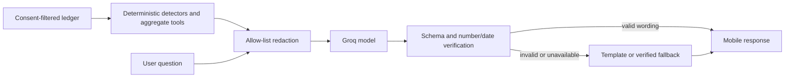

This document describes optional model-powered wording and Ask Your Money chat. It is for users, judges and developers reviewing the AI boundary.
The rules, calculations and insight detectors remain deterministic; the model only selects tools and phrases verified facts.

# AI boundary

## What uses a model

When the global switch and a user's opt-in are both enabled, a Groq-hosted model can rephrase an existing detector result and answer finance questions using backend aggregate tools. AI is off by default. No model categorises transactions, parses statements, determines affordability, or recommends products.

## Data flow

| Sent to model | Never sent |
|---|---|
| Aggregate category and canonical merchant names; detector facts; bounded question text; Naira-formatted money | BVN or hash, phone, email, user name, account number, Mono account id, raw narration, transaction rows, credentials |

The model provider is outside the service trust boundary. Groq receives only bounded, allow-listed inputs. Review Groq account privacy and retention terms before sending real customer data.

## Failure and cost controls

The user's `ai_enabled` preference defaults to false; `AI_ENABLED_GLOBAL=false` disables calls. The provider client has a request timeout, bounded 429/5xx retries, per-user and global daily token budgets, and a process-local chat rate limit. Chat is capped at five tool calls and three model round trips. Any provider, schema or fidelity failure falls back to templates or a verified summary. Audit records contain model, prompt version, token counts, latency, tool names and verification/fallback flags, not prompts or answers.

Token budgets use Groq's reported prompt/completion counts as approximate usage. The local rate limiter is not shared across worker processes. The global kill switch takes effect after the process reloads its environment/configuration.

## Model and prompt changes

Set `AI_PROVIDER=groq`, `GROQ_KEY`, `AI_EXPLAIN_MODEL` and `AI_CHAT_MODEL` in the backend environment. The default models are `llama-3.1-8b-instant` and `llama-3.3-70b-versatile`. Prompt versions are constants in `backend/app/ai/prompts.py`. Startup checks the configured chat model against Groq's model catalogue; if it cannot confirm tool support, chat stays unavailable while template insights remain available.

`make ai-eval` currently runs the fake-client safety suite only; the requested 60-question seeded model evaluation harness is not implemented. Do not treat its result as a model pass rate. No eval was run against live models during this implementation. For provider request shape and tool calling see [Groq API reference](https://console.groq.com/docs/api-reference) and [tool use](https://console.groq.com/docs/tool-use/overview).

## Related docs

- [Consent and privacy](consent-and-privacy.md)
- [AI model matrix](ai-models.md)
- [Known gaps](KNOWN_GAPS.md)
