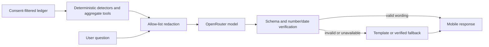

This document describes optional model-powered wording and Ask Your Money chat. It is for users, judges and developers reviewing the AI boundary.
The rules, calculations and insight detectors remain deterministic; the model only selects tools and phrases verified facts.

# AI boundary

## What uses a model

When the global switch and a user's opt-in are both enabled, an OpenRouter-selected model can rephrase an existing detector result and answer finance questions using backend aggregate tools. AI is off by default. No model categorises transactions, parses statements, determines affordability, or recommends products.

## Data flow

| Sent to model | Never sent |
|---|---|
| Aggregate category and canonical merchant names; detector facts; bounded question text; Naira-formatted money | BVN or hash, phone, email, user name, account number, Mono account id, raw narration, transaction rows, credentials |

The model provider is outside the service trust boundary. OpenRouter requests use `provider.data_collection=deny` by default; `AI_REQUIRE_ZDR=true` additionally requests ZDR routing. These filters can reduce available model choices. OpenRouter account privacy settings also apply. In-region routing availability depends on the OpenRouter plan and is not verified for this project.

## Failure and cost controls

The user's `ai_enabled` preference defaults to false; `AI_ENABLED_GLOBAL=false` disables calls. The provider client has a request timeout, bounded 429/5xx retries, configured model fallbacks, per-user and global daily token budgets, and a process-local chat rate limit. Chat is capped at five tool calls and three model round trips. Any provider, schema or fidelity failure falls back to templates or a verified summary. Audit records contain model, prompt version, token counts, latency, tool names and verification/fallback flags, not prompts or answers.

Token budgets use OpenRouter's reported prompt/completion counts as approximate usage. The local rate limiter is not shared across worker processes. The global kill switch takes effect after the process reloads its environment/configuration.

## Model and prompt changes

Set `AI_PROVIDER=openrouter`, `OPENROUTER_API_KEY`, `AI_EXPLAIN_MODEL` and `AI_CHAT_MODEL` in the backend environment. Model values are OpenRouter `vendor/model` slugs; code does not select a fixed vendor model. Optional comma-separated `AI_FALLBACK_MODELS` provides fallback slugs. Prompt versions are constants in `backend/app/ai/prompts.py`. Startup checks the configured chat model against OpenRouter's tools-filtered model catalogue; if it cannot confirm tool support, chat stays unavailable while template insights remain available.

`make ai-eval` currently runs the fake-client safety suite only; the requested 60-question seeded model evaluation harness is not implemented. Do not treat its result as a model pass rate. No eval was run against live models during this implementation. For provider request shape and privacy routing see [OpenRouter Chat Completions](https://openrouter.ai/docs/api/api-reference/chat/send-chat-completion-request?explorer=true), [tool calling](https://openrouter.ai/docs/guides/features/tool-calling), [privacy routing](https://openrouter.ai/docs/guides/get-started/sovereign-ai) and [model catalogue](https://openrouter.ai/docs/api/api-reference/models/get-models).

## Related docs

- [Consent and privacy](consent-and-privacy.md)
- [AI model matrix](ai-models.md)
- [Known gaps](KNOWN_GAPS.md)
