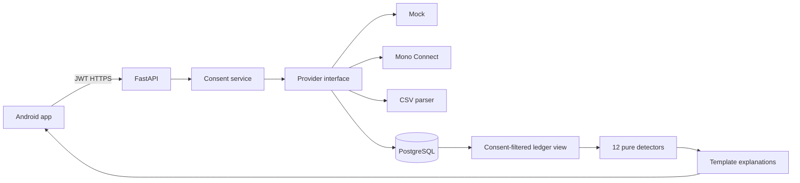

cashlens combines consented account data into one ledger and runs deterministic insight rules. This document is for reviewers and developers.

# Architecture

All money is integer kobo and timestamps are UTC. UUID ownership filters are applied in protected resource queries. Revocation is local-first so data disappears even if a provider unlink call later fails.

## Decisions

The provider interface prevents BVN from becoming a transaction source. Rule-based detectors are explainable and testable; they trade flexibility for predictable results. One Android module keeps hackathon iteration fast. Product suggestions belong in configuration, not detector code.

## Related docs

- [Consent and privacy](consent-and-privacy.md)
- [Detectors](detectors.md)
- [Known gaps](KNOWN_GAPS.md)
